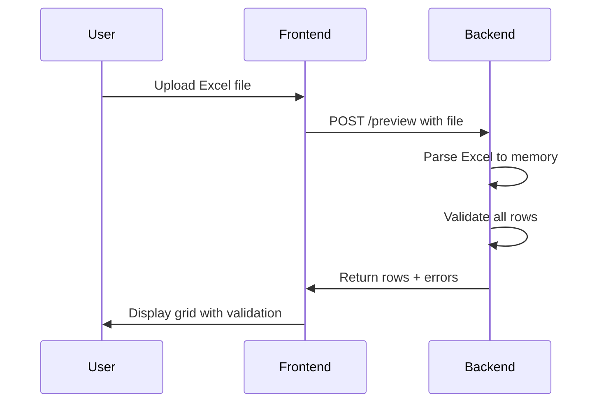
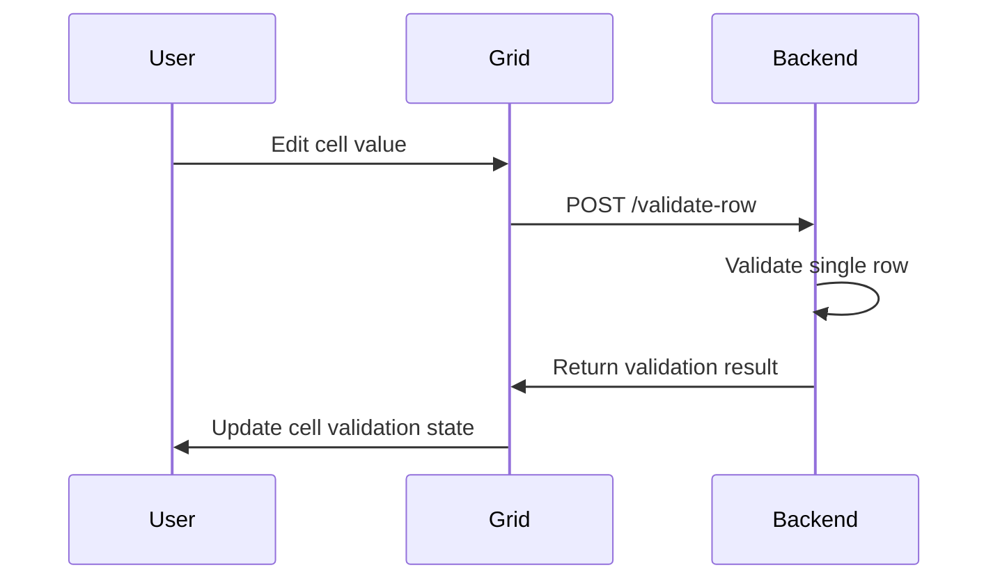
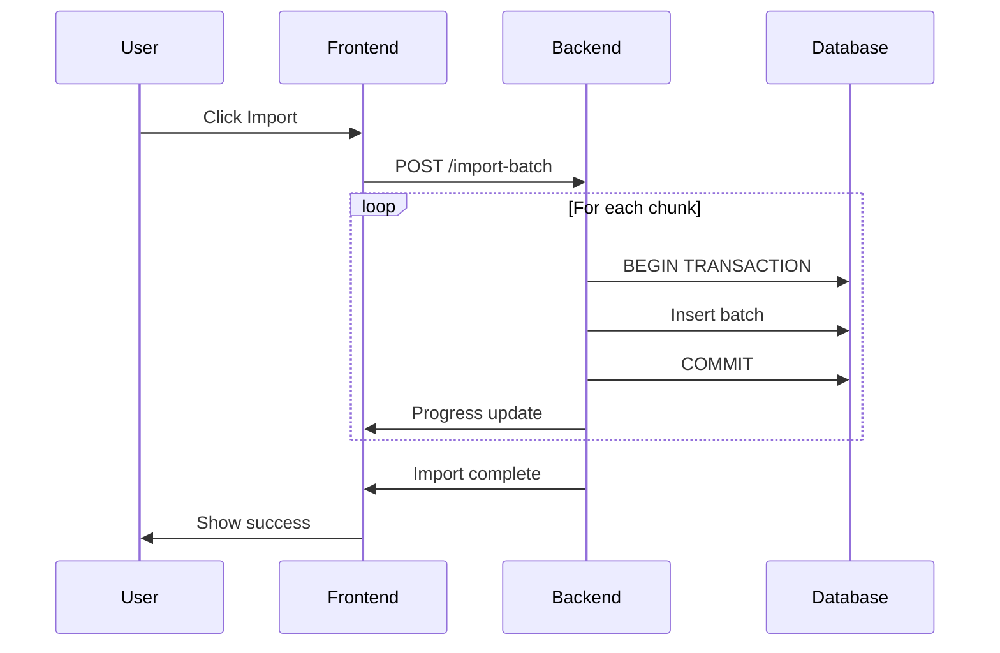

# Advanced Excel Import System Architecture

## Overview
This document outlines the architecture for an advanced Excel import system with preview, validation, and inline editing capabilities for the user management system.

## System Requirements

### Functional Requirements
1. **File Upload & Preview**: Parse Excel files to memory without database writes
2. **Real-time Validation**: Validate each row and display errors with specific cell/column information
3. **Interactive Grid**: Display parsed data in an editable grid with visual validation indicators
4. **Inline Editing**: Allow users to fix validation errors directly in the grid
5. **Dynamic Re-validation**: Re-validate rows on edit via AJAX
6. **Conditional Import**: Enable import only when all validation errors are resolved
7. **Chunked Import**: Process large datasets in chunks with database transactions
8. **Progress Tracking**: Show import progress for large files

### Non-Functional Requirements
- Support files up to 10MB
- Handle up to 10,000 rows efficiently
- Provide sub-second validation feedback
- Maintain data integrity with transactions
- Support Excel (.xlsx, .xls) and CSV formats

## Architecture Design

### Backend Architecture

#### 1. Controller Layer (`UserController.php`)
```
New Endpoints:
- POST /admin/users/preview    - Parse and validate Excel file
- POST /admin/users/validate-row - Validate single row after edit
- POST /admin/users/import-batch - Import validated data in chunks
```

#### 2. Service Layer (New)
```
UserImportService.php
- parseExcelFile(): Parse Excel to array
- validateRows(): Validate all rows
- validateSingleRow(): Validate one row
- importBatch(): Import chunk with transaction
- generateMemberIds(): Pre-generate member IDs
```

#### 3. Validation Layer
```
UserImportValidator.php
- validateRow(): Comprehensive row validation
- checkDuplicates(): Check for duplicates
- validateDepartment(): Validate department names
- validateSession(): Validate session format
- validateEmail(): Email validation with uniqueness
```

#### 4. Data Transfer Objects (DTOs)
```
ImportPreviewDTO
- rows: array of parsed rows
- errors: array of validation errors
- statistics: import statistics

ValidationErrorDTO
- row: row number
- column: column name
- message: error message
- severity: error/warning
```

### Frontend Architecture

#### 1. Components Structure
```
resources/js/Components/Admin/Import/
├── ImportWizard.jsx          - Main import wizard container
├── FileUploader.jsx          - File upload component
├── DataGrid.jsx              - Editable data grid
├── ValidationCell.jsx        - Cell with validation state
├── ImportProgress.jsx        - Progress indicator
└── ImportSummary.jsx         - Final import summary
```

#### 2. State Management
```javascript
ImportState = {
  file: File,
  parsedData: Array<Row>,
  validationErrors: Map<rowId, Array<Error>>,
  editedRows: Map<rowId, Row>,
  importProgress: {
    total: number,
    processed: number,
    status: 'idle' | 'validating' | 'importing' | 'complete'
  }
}
```

#### 3. Data Grid Features
- **ag-Grid** or **React Table** for performance
- Column definitions with validators
- Cell renderers for validation states
- Inline cell editors
- Row highlighting for errors
- Tooltip error messages

### Database Schema Considerations

#### Temporary Storage Table (Optional)
```sql
CREATE TABLE import_sessions (
    id BIGINT PRIMARY KEY,
    session_id VARCHAR(36) UNIQUE,
    data JSON,
    validated_data JSON,
    errors JSON,
    status ENUM('pending', 'validated', 'importing', 'completed'),
    created_at TIMESTAMP,
    expires_at TIMESTAMP
);
```

## Implementation Workflow

### Phase 1: File Upload & Preview


### Phase 2: Inline Editing & Re-validation


### Phase 3: Batch Import


## API Specifications

### 1. Preview Endpoint
```
POST /api/admin/users/preview
Content-Type: multipart/form-data

Request:
- file: Excel/CSV file

Response:
{
  "success": true,
  "data": {
    "rows": [
      {
        "row_id": 1,
        "name": "John Doe",
        "email": "john@example.com",
        "department": "Computer Science",
        // ... other fields
      }
    ],
    "errors": [
      {
        "row": 2,
        "column": "email",
        "message": "Email already exists",
        "severity": "error"
      }
    ],
    "statistics": {
      "total_rows": 100,
      "valid_rows": 95,
      "error_rows": 5
    }
  }
}
```

### 2. Validate Row Endpoint
```
POST /api/admin/users/validate-row

Request:
{
  "row_id": 1,
  "data": {
    "name": "John Doe",
    "email": "john.updated@example.com",
    // ... other fields
  }
}

Response:
{
  "success": true,
  "valid": true,
  "errors": [],
  "member_id": "13241234"
}
```

### 3. Import Batch Endpoint
```
POST /api/admin/users/import-batch

Request:
{
  "rows": [...],  // Validated rows
  "chunk_size": 100,
  "session_id": "uuid"
}

Response:
{
  "success": true,
  "imported": 100,
  "failed": 0,
  "progress": {
    "total": 1000,
    "processed": 100,
    "percentage": 10
  }
}
```

## Error Handling Strategy

### Validation Errors
1. **Field-level errors**: Missing required fields, invalid formats
2. **Business logic errors**: Duplicate emails, invalid departments
3. **Data integrity errors**: Foreign key constraints, unique violations

### Error Display
- **Red cells**: Critical errors that must be fixed
- **Yellow cells**: Warnings that should be reviewed
- **Tooltips**: Detailed error messages on hover
- **Error summary**: List of all errors at the top

## Performance Optimizations

### Backend
1. **Chunked Processing**: Process large files in chunks of 100-500 rows
2. **Caching**: Cache department codes and validation rules
3. **Bulk Queries**: Use bulk insert queries for database operations
4. **Transaction Management**: Wrap imports in transactions for rollback capability

### Frontend
1. **Virtual Scrolling**: For large datasets in the grid
2. **Debounced Validation**: Delay validation API calls on rapid edits
3. **Optimistic Updates**: Update UI before server confirmation
4. **Progressive Loading**: Load and display data progressively

## Security Considerations

1. **File Validation**: Strict file type and size validation
2. **Input Sanitization**: Sanitize all Excel data before processing
3. **Rate Limiting**: Limit import requests per user
4. **Session Management**: Expire preview sessions after 30 minutes
5. **Authorization**: Verify admin permissions for all endpoints

## Testing Strategy

### Unit Tests
- Validation logic for each field
- Member ID generation
- Date parsing functions
- Department normalization

### Integration Tests
- File upload and parsing
- Validation endpoint responses
- Batch import with transactions
- Error handling scenarios

### E2E Tests
- Complete import workflow
- Error correction flow
- Large file handling
- Concurrent imports

## Implementation Phases

### Phase 1: Backend Infrastructure (2-3 days)
- Create service layer
- Implement preview endpoint
- Build validation system
- Add row validation endpoint

### Phase 2: Frontend Grid (2-3 days)
- Implement data grid component
- Add inline editing
- Create validation cell renderers
- Build error display system

### Phase 3: Import Process (1-2 days)
- Implement chunked import
- Add transaction management
- Create progress tracking
- Build import summary

### Phase 4: Testing & Optimization (1-2 days)
- Write comprehensive tests
- Performance optimization
- Error handling refinement
- Documentation

## Technology Stack

### Backend
- **Laravel 11**: Framework
- **Maatwebsite/Excel**: Excel parsing
- **Laravel Validation**: Data validation
- **MySQL Transactions**: Data integrity

### Frontend
- **React**: UI framework
- **Inertia.js**: Server-side routing
- **ag-Grid** or **TanStack Table**: Data grid
- **Tailwind CSS**: Styling
- **Axios**: API calls

## Success Metrics

1. **Import Success Rate**: >95% successful imports
2. **Validation Accuracy**: 100% error detection
3. **Performance**: <2s for 1000 row validation
4. **User Satisfaction**: Reduced support tickets by 50%
5. **Data Quality**: Zero corrupt imports

## Future Enhancements

1. **Template Mapping**: Allow custom column mapping
2. **Import History**: Track all imports with rollback
3. **Scheduled Imports**: Automated imports from FTP/API
4. **Export Errors**: Download validation errors as Excel
5. **Bulk Operations**: Update/delete existing records
6. **Real-time Collaboration**: Multiple users editing same import